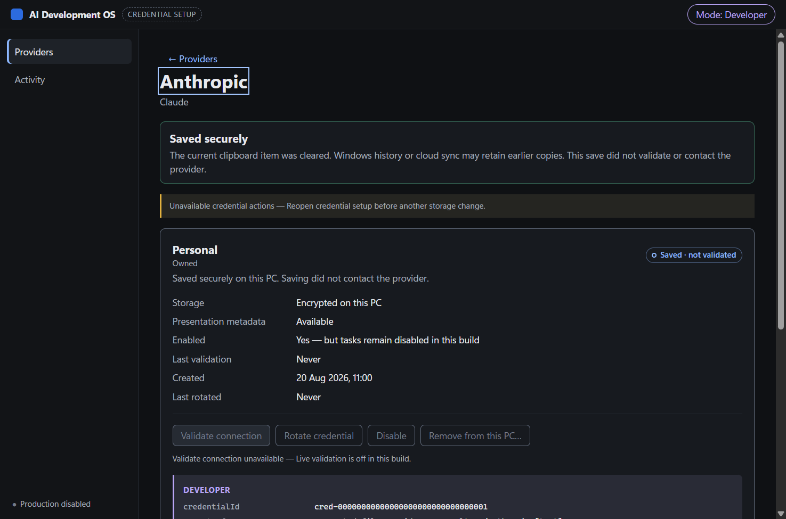

# Stage 18E-H credential-setup host checkpoint

Date: 2026-08-21
Status: production-disabled implementation candidate
Branch: `feat/stage-18e-credential-setup-host`
Stack base: `cf24aa5fb726e1135947050f34367b935419fe47`
Base tree: `61b57e857685ac3f1254a87131148735dbe54a64`

## Outcome

This checkpoint adds the Electron-free `@ai-dev-os/credential-ui` package and the bounded Windows Electron host at `apps/credential-setup`. The host presents the four Stage 18E provider slots, supports synthetic save, rotate, enable/disable, removal, recovery projection, and separately disclosed validation, and composes only the committed application-owned vault manager and its policy-aware resolver.

The runnable surface remains production-disabled. Saving never validates or contacts a provider. Production validation is disabled, no live transport is composed, no real credential was requested or used, and no Account Manager or Windows Credential Manager state was accessed.

## Security and composition boundary

- The renderer package imports no Electron, Node, filesystem, network, provider-adapter, policy, or orchestration implementation. It consumes finite view models and invokes typed callbacks only.
- The main process is the sole constructor of the Stage 18E vault manager. Credential reads, including validation reads, pass through `createPolicyAwareSecretResolver`; the host does not import a storage or crypto port.
- The dedicated in-memory Electron session loads only `app-credential://entry/index.html`. The protocol allowlist contains exactly `index.html`, `entry.js`, and `entry.css`.
- The window uses sandboxing, context isolation, disabled Node integration, enabled web security, a strict CSP with `connect-src 'none'`, content protection, and denials for navigation, redirects, popups, webviews, downloads, permissions, display capture, and device access.
- The preload exposes seven typed methods backed by the six reviewed channels: `credential-vault:describe`, `credential-vault:save`, `credential-vault:rotate`, `credential-vault:remove`, `credential-vault:validate`, and `credential-vault:cancel`. It does not expose `ipcRenderer`, events, or a generic send/invoke primitive.
- Every request is bound to schema version 1, a fixed-format request ID, the session token, the exact top frame/origin/session/webContents, a legal session state, and—where applicable—the authoritative credential ID, document revision, and record token.
- The documented flat-schema extension adds `nickname`, `ownership`, `authorizedBy`, and `clearClipboard` to save; identity/revision/token and `clearClipboard` to rotate; and multiplexes enable/disable and destructive removal on the closed `remove` channel with an exact `action` discriminator. No seventh authority-bearing channel was added.
- Secrets are written only to the application-owned encrypted vault. The strict sidecar contains nonsecret presentation metadata only: save and rotate reject exact values, short values, last-four fragments, and split/concatenated fragments in either direction before mutation, while the at-rest parser rejects credential-shaped labels. Its file reader opens and stats a regular file before allocation, enforces the 131,072-byte cap, performs an exact bounded read plus a growth-byte check, zeroes owned buffers, and always closes the handle.
- Validation composes a host-only random operation identity, a provider-disclosure decision followed by secret-access, and the disclosure fingerprint bound into the resolver context. One absolute deadline and AbortController cover policy, decrypt, dispatch, and settlement. Wall time is rechecked immediately before the one permitted transport call and after resolver settlement; a late result is ignored as unreachable, while still-live work retains the global reservation and is drained by close.
- The entry-session machine rejects concurrent submission and replay after commit. The renderer synchronously blocks stale actions before mutation, validation, removal, and post-commit refresh awaits; committed or unknown storage outcomes require reopen, while a recoverable conflict refreshes authoritative state before retry.
- Successful removal destroys the ciphertext and leaves the foundation tombstone; later re-entry uses the bounded rotate path. Every successfully constructed broker is tracked before resolver binding and is settled with the manager on partial composition failure.
- The renderer removes its password input before awaiting a mutation result. Escape, native close, cancellation, refused navigation, crash/close lifecycle, and the ten-minute idle watchdog destroy the surface and clear references.
- Clipboard clearing defaults on, is selectable, never reads clipboard content, occurs only after confirmed vault commit, and reports the actual main-process result plus the Windows history/cloud-sync limitation.
- Normal and Developer modes expose independently captured, identical action sets. Developer mode adds only nonsecret identifiers, exact timestamps, finite codes, and display-truncated fingerprints; it grants no additional authority and displays no mask, last four characters, or key fragment.

Electron is pinned as a development-only dependency and peer at `~43.4.1`. On 2026-08-21, the [official Electron v43.4.1 release](https://github.com/electron/electron/releases/tag/v43.4.1) was marked Latest and recorded as released on 2026-08-19; its notes include custom-protocol opacity and sandbox-inheritance fixes relevant to this boundary. The external verifier runs the explicit restore helper before launching Electron. That helper rejects platform, architecture, version, artifact, and checksum-bypass overrides, invokes the package's bundled checksummed installer only when the exact runtime is absent, and verifies the resulting executable. The production main independently asserts the compatible runtime before scheme, session, protocol, or surface registration.

## Local assurance

All checks used obviously synthetic values and temp-bounded `appData`/`userData` paths.

- Clean root `npm ci`: PASS; 194 packages installed, 239 audited, zero vulnerabilities. The reviewed helper then restored and verified the exact Electron 43.4.1 runtime before the post-install smoke.
- `npm audit --audit-level=high`: PASS; zero vulnerabilities.
- `npm run check`: PASS in 1,725.5 seconds; every workspace typecheck, test, and build completed.
- `npm run test:coverage`: PASS in 1,021.2 seconds; every configured workspace threshold completed.
- Credential UI logic: 2 test files / 25 tests PASS; 100% statements, 98.59% branches, 100% functions, and 100% lines across the explicitly instrumented `contracts.ts`, `errors.ts`, and `projections.ts` logic. The browser renderer and CSS are deliberately evidenced by the real-Electron suite below, not represented as instrumented unit coverage.
- Credential host: 11 test files / 154 tests PASS; 91.79% statements, 86.31% branches, 100% functions, and 97.24% lines across main-process modules other than the executable wiring entry.
- Stage 18 completeness audit: 10/10 tests PASS.
- Windows native addon boundary: `/W4 /WX` rebuild PASS; the replacement shape verifier loaded the addon and inspected the exact `availability`/`read` exports while invoking neither (`credential-manager-calls:0`). No Windows Credential Manager operation ran.
- Host real-Electron smoke: PASS on Electron 43.4.1 with 69 assertions: 63 default, 2 reduced-motion, and 4 forced-colours.
- Host packed verifier: PASS; nine packed workspaces, 65 application files, exactly three renderer files, scripts-disabled lockfile-exact clean install, high-severity audit clean, exact seven-function bridge, and the exact packed production main running in Electron 43.4.1.
- AM-02 packed consumer: PASS with 27/27 probes, lockfile-exact scripts-disabled install, zero high-severity audit findings, and the pinned Account Manager reader identity.
- Foundation packed consumer: PASS (`pure`, `filesystem`, manager/broker-only production boundary, no secret projection).
- Foundation real-Electron safe-storage smoke: PASS with synthetic-only input.
- Protected-package diff for `packages/secrets`, `packages/policy`, `packages/provider-anthropic`, and `packages/secrets-windows`: empty.

Disk accounting after the gates found 725,959 bytes across the 53 newly added host, UI, and screenshot paths, excluding this self-describing evidence markdown. The complete candidate has 59 paths: 54 new paths including this file, plus five modified tracked paths. Task-owned generated `dist` and coverage output for the host and UI totals 1,932,510 bytes. The shared clean `node_modules` installation measures 485,006,212 bytes; the Windows native build output measures 4,193,505 bytes. Sixty-two smoke and packed-consumer temp roots created during the branch task retain 147,844,155 bytes; the final smoke root is 339,736 bytes and the final packed-host root is 15,406,940 bytes. They were deliberately not destructively removed. No repository copy or NuGet cache was created.

The behavioral suites cover the six IPC handlers; hostile getters/proxies and malformed schemas; sender-before-projection, invocation-rate, token-before-operation, origin, frame, session, and webContents gates; replay and concurrent-write ownership; revision races; interruption and unknown outcomes; clipboard outcomes; bounded/corrupt metadata reads and secret-fragment separation; corrupt, backup-only, schema-ahead, backend, and identity recovery projections; two-decision policy-aware validation reads; pre-dispatch and post-settlement absolute-deadline races; exactly one fake validation dispatch and background drain; stale-result discard; inconclusive-result preservation; construction/startup failure cleanup; CSP and dependency policy; protocol traversal; navigation/popup/permission/download denial; and diagnostic leakage canaries. The actual renderer suite exercises the historical AR-01 through AR-24 behavior families, including future multi-credential provider grouping, metadata/recovery disclosure gates, post-commit legality, all five finite validation presentations, and no-IPC freshness rerenders.

## Runtime UX evidence

- Keyboard-only picker, entry, ownership, clipboard choice, cancel, and save flow passed. Provider cards and the picker group future multiple credentials into one provider row with a pessimistic status matrix. The conditional authorization field is absent from the tab order when hidden; authorised-to-owned correction clears its hidden value; focus moves deliberately after rerender and route changes; and no duplicate IDs remain.
- Repeated Escape remained inert during each gated save, validation, and removal operation. Three ordinary entry-cancel surfaces were destroyed with zero live windows afterward. Hostile `beforeunload` could not cancel native close; refused navigation, F5, Ctrl+R, and renderer crash also destroyed the surface.
- In-flight and post-commit reasons are visible next to every disabled action. A committed mutation synchronously locks every storage change with reopen guidance while leaving validation available only when the authoritative session and build permit it; stale or detached invocations remain refused by main-process state.
- Validation discloses one authentication-only provider read, a 10-second absolute provider-attempt deadline, no retry, no prompt/task content, no cost, and finite nonsecret recording. The renderer allows up to 12 seconds for secure local closure. All five finite outcomes retain an exact checked-at time and truthful refresh-failure warning.
- Normal and Developer modes independently produced identical action sets. Developer diagnostics added only bounded nonsecret facts and rendered fingerprints in truncated form; no full 64-hex fingerprint appeared visually.
- A 30-second local freshness rerender crossed fresh-to-stale without IPC, live-region churn, focus loss, or idle animation. Operator-triggered route changes deliberately moved focus to the destination heading.
- Reduced motion matched and yielded `0s` animation and transition durations.
- Forced colours matched system colours for badges, navigation, notices, subtle/danger buttons, radios, and checkboxes; focus and selection retained solid redundant cues, and no horizontal overflow appeared.
- Minimum measured text contrast was 4.911459:1. Minimum essential non-text control-boundary contrast was 3.012572:1.
- Viewports 900x700, 1180x780, and 2560x1440 had no horizontal overflow or clipped status badges, including legal 40-character unbroken labels and visible action reasons.
- Render-to-frame measured 40.2 ms against the enforced 60 ms budget, with no measured long tasks.
- The regenerated screenshot is 1475x975. The runtime canary was absent from DOM text/values, console records, audit records, process diagnostics, screenshots, and serialized reports. The saved surface contained no password input.

## Project truth and limitations

- `AM-02`: proven.
- `INT-01`: proven.
- `ANT-02`: incomplete.
- `PLN-02`: incomplete.
- `developmentAccepted=false`.
- `productionAdmitted=false`.
- Stage 20A remains ineligible.

Schema version 1 permits one active credential per provider slot. Live provider validation, production activation, installers/updaters, export/backup, Linux/macOS integration, Stage 20 controls, and the complete Stage 21 application remain out of scope. The smallest next action after publication is independent external review of the exact runnable host by Opus and Fable. A real key and one disclosed Anthropic validation attempt require separate future operator authorization after those reviews pass.

The independent pre-publication source/security and UX/accessibility verdicts are bound to an external aggregate manifest of the final candidate bytes. Their exact subject and verdicts are recorded in the publication report so this evidence file does not need a self-referential post-review edit.
