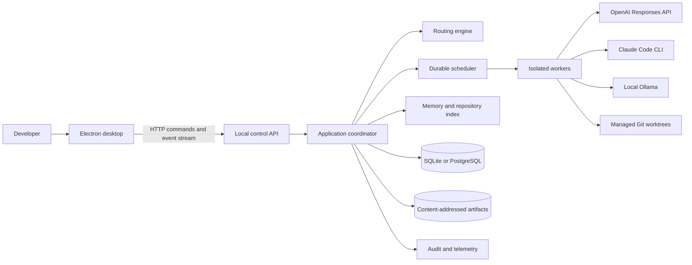

# AI Development OS Technical Design

Status: Accepted baseline  
Version: 0.1  
Last updated: 2026-08-02

## 1. Executive summary

AI Development OS is a local-first control plane for software engineering agents. It converts a user request into a validated task graph, selects models through a policy-constrained router, executes independent work concurrently in isolated repository snapshots, validates and integrates the results, and records enough state to explain and recover every decision.

The system is not a conversational wrapper. Conversation is one input and presentation mechanism. The durable unit of work is a `Run`; its executable plan is a directed acyclic graph of typed `Task` records; and every side effect occurs through a policy-authorized `Attempt` with an auditable execution lease.

The initial product is a single-user desktop application backed by a local daemon and SQLite. The same domain and application modules support a team deployment backed by PostgreSQL and remote object storage. The first release is a modular monolith with isolated worker processes. It does not begin as a fleet of microservices.

## 2. Scope

### 2.1 In scope

- Request analysis, task classification, complexity estimation, token and cost estimation, and duration prediction.
- Configurable model routing using deterministic rules, live capabilities, learned outcome statistics, and a structured LLM classifier.
- Static and dynamically extended task graphs with bounded parallel execution.
- OpenAI Responses API, Claude Code CLI, and native Ollama adapters.
- Repository discovery, commit-scoped indexing, Git worktree isolation, deterministic validation, and controlled integration.
- Conflict detection, independent review, evidence-based disagreement resolution, and human approval gates.
- Persistent project memory, explicit user preferences, provenance-aware retrieval, and scoped caching.
- Multi-project operation, desktop monitoring, plugin extension, observability, and recovery after crashes.

### 2.2 Non-goals for the first production release

- A general autonomous computer operator.
- Unattended publication, deployment, force-push, or destructive repository operations.
- Training or fine-tuning foundation models.
- A public plugin marketplace accepting untrusted native code.
- Exactly-once execution. The scheduler is at-least-once and side effects are made idempotent or reconciled.
- Automatic trust in model consensus. Deterministic validation and policy always take precedence.

## 3. Architectural principles

1. **Policy before intelligence.** Models may propose tasks, routes, commands, memory, and resolutions. Deterministic code validates and authorizes them.
2. **Durable state before streaming state.** The database is authoritative. UI streams are projections that can be replayed.
3. **Typed artifacts before prose handoffs.** Tasks exchange schemas, diffs, commits, test manifests, and content-addressed artifacts.
4. **Isolation before parallel writes.** Every repository-writing attempt uses its own recorded snapshot and managed worktree.
5. **Capabilities before product names.** Roles map to required capabilities. Model and provider identifiers remain configuration and runtime catalog data.
6. **Local first, not local only.** Sensitive projects can be kept entirely local, while approved projects can use remote providers.
7. **Explain every route.** Candidate rejection reasons, score components, price snapshots, health, and confidence are persisted.
8. **Bound every recursive process.** Graph size, fan-out, depth, attempts, tool calls, tokens, money, wall time, and output bytes all have limits.
9. **Treat all content as untrusted.** Repository text, tool output, memories, model output, plugins, and remote responses can contain prompt injection or hostile data.
10. **Keep the control plane small.** The trusted core contains domain invariants, policy, leases, credentials, audit, and persistence transactions. Provider and plugin processes remain outside it.

## 4. System context



### 4.1 Runtime processes

| Process | Responsibility | Trust level |
| --- | --- | --- |
| Electron renderer | Dashboard presentation and user input | Untrusted renderer |
| Electron main | Window lifecycle and narrow authenticated bridge | Trusted but capability-minimal |
| Control daemon | API, application use cases, routing, policy, scheduling, persistence | Trusted control plane |
| Worker supervisor | Starts isolated attempts and enforces leases and quotas | Trusted enforcement boundary |
| Attempt worker | Provider adapter and task-specific tools | Untrusted workload |
| Plugin host | Versioned plugin RPC and capability mediation | Untrusted extension |
| SQLite/PostgreSQL | Durable metadata, event journal, indices, and ledgers | Trusted persistence |
| Artifact store | Immutable large payloads addressed by digest | Untrusted content, integrity checked |

The Electron main process launches or discovers exactly one local daemon using an OS-level lock. The daemon listens on a random loopback port and writes a user-readable-only connection descriptor containing a short-lived session credential. A future team daemon uses TLS, OIDC, RBAC, PostgreSQL, and remote artifact storage instead of desktop session authentication.

## 5. Technology baseline

| Concern | Choice | Rationale |
| --- | --- | --- |
| Language | Strict TypeScript on Node.js 22+ | Shared contracts across daemon, workers, adapters, and desktop; mature process and SDK support |
| Control API | Fastify with JSON Schema/OpenAPI | Low overhead, explicit validation, streaming support, testable injection model |
| Desktop | Electron, React, Vite, TanStack Query | Direct local process integration and a thin recoverable UI projection |
| Local database | SQLite in WAL mode | Zero-administration, transactional desktop persistence |
| Team database | PostgreSQL | Concurrent leasing, operational tooling, row-level access patterns, optional vector extension |
| SQL access | Kysely plus explicit migrations | Typed queries without hiding transaction and locking semantics |
| Artifact storage | Local content-addressed files; S3-compatible adapter later | Deduplication, integrity checks, and portable metadata |
| Validation | JSON Schema at boundaries; strict TypeScript internally | Provider-neutral schemas and runtime safety |
| Telemetry | OpenTelemetry, structured JSON logs, append-only usage ledger | Correlated traces and vendor-neutral export |
| Tests | Vitest, property tests, provider contract fixtures, Playwright | Fast domain tests plus real desktop and repository behavior |

Dependency versions are pinned in the lockfile. Automated update pull requests run compatibility, provider-contract, desktop, and security suites before merge.

## 6. Module architecture

Dependencies point inward: adapters depend on application ports; application depends on domain; domain has no I/O dependencies.

| Module | Primary responsibility | May depend on |
| --- | --- | --- |
| `domain` / `task-graph` | IDs, tasks, graph invariants, artifacts, budgets, state transitions | Standard library only |
| `application` | Request lifecycle, run coordinator, use cases, transaction boundaries | Domain ports |
| `scheduler` | Readiness, leases, heartbeats, retry policy, capacity, cancellation | Domain, persistence ports, policy port |
| `router` | Profiling, feasibility filters, scoring, fallback, decision explanation | Domain, provider catalog ports, metrics ports |
| `providers` | Normalized inference and coding-agent contracts | Domain contracts |
| `provider-openai` | OpenAI Responses adapter | Provider contract, OpenAI SDK |
| `provider-claude-code` | Claude Code process adapter and reconciliation | Coding-agent contract, process broker |
| `provider-ollama` | Ollama inference and local capacity adapter | Provider contract, HTTP client |
| `workspace` | Repository snapshots, worktrees, diffs, validation, integration | Git/process ports, policy |
| `memory` | Facts, decisions, preferences, repository index, retrieval, cache | Domain, storage and embedding ports |
| `evaluation` | Schema checks, critics, deterministic validators, arbitration | Domain, provider and workspace ports |
| `plugins` | Manifest discovery, compatibility, RPC, permission grants | Domain, policy and process ports |
| `persistence` | SQLite/PostgreSQL repositories, migrations, outbox, artifact metadata | Application ports |
| `api` | Authenticated HTTP commands, queries, OpenAPI, event replay | Application use cases |
| `desktop` | Dashboard, query cache, projections, approvals | Generated API client only |
| `observability` | Trace propagation, redaction, metrics, audit and usage events | Cross-cutting ports |

Provider adapters, plugins, persistence implementations, and the UI do not call one another directly.

## 7. Core domain model

### 7.1 Principal records

| Record | Purpose |
| --- | --- |
| `Project` | Repository roots, data policy, configuration, budgets, memory scope |
| `RepositorySnapshot` | Immutable source identity: project, Git SHA, dirty overlay digest, index version |
| `Run` | One accepted user objective and its global budgets and outcome |
| `Task` | Typed unit in a run DAG, with dependencies and acceptance criteria |
| `TaskEdge` | Dependency relation between tasks |
| `Attempt` | One leased execution of a task by one provider/model in one workspace |
| `Artifact` | Immutable typed output with digest, media type, schema, size, and provenance |
| `RoutingDecision` | Complete candidate set, filters, score terms, selected route, and confidence |
| `Approval` | One-shot authorization bound to a normalized action digest |
| `Memory` | Scoped, sourced, confidence-bearing fact, decision, or summary |
| `Preference` | Explicit preference or untrusted inferred candidate pending confirmation |
| `ProviderHealth` | Capability and availability snapshot used for a route |
| `UsageEntry` | Immutable estimated/reserved/actual token, money, time, and local compute ledger entry |
| `DomainEvent` | Ordered fact emitted by a successful state transaction |

### 7.2 Task specification

Each task includes:

- Stable task ID, kind, title, objective, and priority.
- Dependency task IDs and typed input artifact references.
- Declared output artifact schemas.
- Required capabilities such as reasoning, repository read, code edit, shell, testing, or documentation.
- Workspace mode: none, immutable snapshot, or isolated writable worktree.
- Acceptance criteria and deterministic validation commands.
- Data classification and allowed provider classes.
- Token, cost, duration, retry, tool-call, output-size, and recursion budgets.
- Idempotency class: pure, replayable, reconcilable, approval-bound, or irreversible.
- Merge strategy and files or ownership areas when known.

### 7.3 State machines

Task states are:

```text
pending -> ready -> running -> succeeded
                    |  |  |
                    |  |  +-> failed
                    |  +----> waiting -> running
                    +-------> needs_resolution -> running

pending/ready/running/waiting/needs_resolution -> cancelled
pending/ready -> blocked when an upstream dependency ends unsuccessfully
```

Attempt states are separate from task states:

```text
leased -> running -> succeeded
   |         |  +-> failed
   |         +----> cancelled
   +--------------> abandoned
```

The separation is essential: a retry creates a new attempt while the task can remain logically runnable. Terminal task failure occurs only after retry policy or a non-retryable failure is resolved.

All mutations use optimistic aggregate versions. The persistence adapter reads pending events without removing them, saves the current state and idempotent event inserts in one transaction, commits, and only then acknowledges the persisted event sequence in memory. A rollback leaves the events available for retry.

## 8. End-to-end request lifecycle

1. **Accept.** Validate project, objective, requested scope, data policy, and budget. Create an immutable request artifact and `Run`.
2. **Inspect.** Capture a repository snapshot and retrieve high-signal structure, manifests, ownership rules, prior decisions, and explicit preferences.
3. **Profile.** Produce a schema-validated `TaskProfile` with kind, complexity, context need, risk, edit scope, reasoning need, and confidence.
4. **Estimate.** Predict input/output tokens, provider cost, queue time, execution duration ranges, local compute load, and validation time.
5. **Plan.** Rules handle simple work directly. Complex work uses a planning route to propose a bounded task DAG with typed outputs and acceptance criteria.
6. **Validate plan.** Deterministic code checks acyclicity, scopes, permissions, budgets, graph quotas, schemas, and provider feasibility.
7. **Route.** Filter impossible candidates, score eligible routes, reserve budget, and persist the routing decision.
8. **Dispatch.** The scheduler leases ready tasks subject to project fairness, provider rate limits, local compute capacity, and workspace locks.
9. **Execute.** A worker receives a scoped lease, sanitized context pack, provider request, workspace grant, and cancellation signal.
10. **Collect.** Stream normalized events to durable storage. Store large or sensitive payloads as redacted content-addressed artifacts.
11. **Validate.** Check schemas, diffs, allowed paths, compilation, tests, static policy, and task-specific acceptance criteria.
12. **Integrate.** Serialize repository integration in dependency order. Revalidate against the current target snapshot.
13. **Resolve.** Use deterministic merge conflict detection first. A resolver model may propose a patch, but validation and policy decide acceptance.
14. **Review.** A quality route examines the combined result and evidence, not merely individual outputs.
15. **Complete.** Reconcile actual usage, create the run summary, propose durable memories, and expose provenance in the dashboard.

Every step is resumable after a daemon restart from the database, attempt leases, provider IDs, worktrees, commits, and artifact digests.

## 9. Task graph and scheduler

### 9.1 Graph rules

- Planning may add nodes and edges atomically until the graph is sealed.
- Dynamic expansion after sealing is a separate validated command and is bounded by maximum nodes, depth, fan-out, and remaining budget.
- A task becomes ready only when all dependencies succeed.
- An unsuccessful dependency blocks downstream work recursively.
- Topology changes never occur through raw database writes.
- Ready order is deterministic by priority and stable insertion order before scheduler fairness and capacity constraints are applied.
- Cancellation is hierarchical: run cancellation revokes leases, stops process trees, and marks remaining tasks without erasing partial evidence.

### 9.2 Leasing and recovery

The scheduler provides at-least-once execution:

1. Atomically select a ready task and create an attempt and expiring lease.
2. Reserve provider and budget capacity in the same transaction.
3. Start the worker with an unforgeable lease token scoped to project, snapshot, worktree, actions, deadline, and limits.
4. Renew the lease through heartbeats and persist provider continuation identifiers.
5. On completion, reconcile artifacts and side effects before committing attempt success.
6. If the worker disappears, wait for lease expiry, inspect its worktree/provider state, and then mark succeeded, failed, or abandoned before retry.

SQLite desktop mode has one authoritative scheduler process and multiple isolated workers. Team mode uses PostgreSQL row locks with `SKIP LOCKED` semantics and fencing tokens. Both implementations satisfy the same scheduler contract.

### 9.3 Idempotency

- Provider calls carry an attempt ID and provider-supported idempotency key where available.
- Generated files live only in the attempt worktree until integration.
- Commits and artifacts are content-addressed and can be reconciled after a crash.
- External mutations such as push or deployment require approval, record an action digest, and use a dedicated idempotency record.
- Retries never assume a timed-out call failed. The adapter must reconcile when the provider exposes continuation or response status.

### 9.4 Capacity and fairness

Resource pools cover remote concurrency, provider rate limits, local CPU, local RAM, GPU/VRAM, worktree count, disk, and per-project concurrency. Weighted fair queuing prevents one project or recursive plan from monopolizing workers. Backpressure stops new admissions before resource exhaustion.

## 10. Intelligent routing

### 10.1 Task profile

The request analyzer emits a versioned structure containing:

```ts
interface TaskProfile {
  kind: "plan" | "architecture" | "implement" | "refactor" | "debug" |
    "review" | "test" | "document" | "shell" | "explain" | "transform";
  complexity: 1 | 2 | 3 | 4 | 5;
  repositoryFiles: number;
  repositoryBytes: number;
  relevantContextTokens: number;
  expectedOutputTokens: number;
  reasoning: "low" | "medium" | "high" | "extreme";
  editScope: "none" | "single-file" | "multi-file" | "cross-package";
  risk: "low" | "medium" | "high" | "critical";
  requiredCapabilities: string[];
  dataClass: string;
  confidence: number;
}
```

Repository metrics are measured. Token counts use provider-compatible tokenizers where available and conservative byte-based bounds otherwise. Complexity combines deterministic features with a structured classifier. Duration estimates are ranges, not single promises, and include provider queue, inference, tools, tests, and integration.

### 10.2 Routing pipeline

1. **Hard feasibility filters:** data policy, capabilities, context window, required tools, repository write support, model health, authentication, budget, deadline, plugin grants, and local resource availability.
2. **Rule route:** high-confidence rules select routine specialist work without an LLM classifier.
3. **Classifier route:** low-confidence requests use an inexpensive structured classifier. Its output is schema-validated and cannot override hard constraints.
4. **Candidate scoring:** eligible candidates receive an explainable score.
5. **Fallback construction:** persist an ordered fallback chain before dispatch.
6. **Reservation:** reserve the p90 estimated cost and capacity; reconcile with actual usage later.

A baseline score is:

```text
utility =
    qualityWeight     * predictedSuccess
  - costWeight        * normalizedCost
  - latencyWeight     * normalizedP90Duration
  + localityWeight    * localPreference
  + reliabilityWeight * recentReliability
  + preferenceWeight  * explicitUserFit
  - queueWeight       * normalizedQueueDelay
```

`predictedSuccess` uses task-kind-specific Beta priors and decayed observed outcomes. Latency uses rolling quantiles. Exploration is disabled for high-risk tasks and tightly bounded elsewhere. Model-generated quality scores never update success statistics until deterministic checks or an explicit user outcome provide a label.

### 10.3 Confidence and escalation

- High-confidence, low-risk selections execute directly within policy.
- Low-confidence selections can request one independent classifier or use the configured conservative route.
- Critical tasks can require plan review, implementation, and independent review by different routes.
- If top candidates disagree within a configured margin, the router favors the lower-risk candidate or asks for approval rather than creating false precision.

### 10.4 Configured role policies

The requested default roles are represented as editable policy, not source-code conditionals:

| Logical role | Default route policy |
| --- | --- |
| Product manager, architect, planner, prompt engineer, reviewer, quality controller | Approved GPT model with the required reasoning and context capabilities |
| Primary implementation, broad refactor, complex debugging, repository editing | Claude Code coding-agent adapter |
| Reasoning, planning, algorithms | Local `deepseek-r1:8b` preference |
| Documentation, summaries, Markdown | Local `gemma3:12b` preference |
| Shell, scripting, lightweight code | Local `mistral:7b` preference |
| Tests, regular expressions, transformations | Local `qwen3:8b` preference |
| Explanation and lightweight interaction | Local `llama3.2:3b` preference |

Health, data policy, measured performance, context fit, and budget can override a default preference. The routing decision records that override.

## 11. Provider framework

Inference providers and autonomous coding agents have different contracts:

```ts
interface InferenceProvider {
  describe(): ProviderManifest;
  listModels(signal?: AbortSignal): Promise<ModelDescriptor[]>;
  health(signal?: AbortSignal): Promise<HealthReport>;
  invoke(
    request: InferenceRequest,
    context: AttemptContext,
  ): AsyncIterable<NormalizedProviderEvent>;
  cancel(attemptId: string): Promise<void>;
  reconcile(attemptId: string): Promise<ReconciliationResult>;
}

interface CodingAgentProvider {
  describe(): ProviderManifest;
  health(signal?: AbortSignal): Promise<HealthReport>;
  start(
    request: CodingRunRequest,
    workspace: WorkspaceGrant,
    context: AttemptContext,
  ): AsyncIterable<CodingRunEvent>;
  cancel(attemptId: string): Promise<void>;
  reconcile(attemptId: string): Promise<ReconciliationResult>;
}
```

Normalized events cover lifecycle, text deltas, reasoning summaries where policy allows them, tool intents, tool results, file changes, usage, warnings, errors, and terminal results. Raw provider events can be retained as encrypted diagnostic artifacts subject to retention policy, but application logic consumes only normalized events.

### 11.1 OpenAI adapter

- Use the Responses API for reasoning, structured outputs, tools, streaming, and provider continuation.
- Support foreground streaming and background responses for long work. Persist response identifiers before polling or reconnecting.
- Expose model capabilities and pricing through a versioned runtime catalog. Do not hardcode a permanent flagship model ID.
- Record input, output, cached, and reasoning token categories exactly as returned.
- Make provider storage and retention behavior explicit per project; support `store: false` where compatible with the selected execution mode.
- Use a stable privacy-preserving safety identifier when configured for multi-user service mode.
- The adapter is disabled until a secret reference is configured. Keys never enter project configuration or worker-wide environments.

### 11.2 Claude Code adapter

- Probe the installed CLI version and supported features at startup.
- Use non-interactive print mode with machine-readable streaming output.
- Pass prompts over stdin or protected files, not shell-concatenated command strings.
- Run in a managed worktree with a scrubbed environment, explicit tool restrictions, turn and budget caps, and an approval broker for permission prompts.
- Never use permission-bypass flags in production.
- Parse partial and malformed streams defensively, cap output, sanitize terminal controls, and terminate the entire process tree on cancellation.
- Treat a zero exit code as transport success only. Task success still requires artifact, diff, path-policy, and validation checks.
- Reconcile a crash by inspecting session metadata, worktree diff, commits, and expected artifacts.

The installed CLI can expose new flags over time, so the adapter maintains a tested version-capability matrix instead of assuming `--help` is exhaustive.

### 11.3 Ollama adapter

- Use the native local API for model discovery, health, chat streaming, structured output where supported, reasoning controls, and keep-alive behavior.
- Treat local inference as metered: record prompt/evaluation tokens, load time, generation time, queue delay, CPU/GPU time, and peak memory.
- Use a capacity manager so large models do not compete for unavailable VRAM/RAM.
- Bind Ollama to loopback or place it behind an authenticated local gateway. It is not exposed directly to a LAN.
- Validate installed model identity and digest. A configured family preference may fall back only to a capability-compatible local or approved remote route.

## 12. Repository intelligence and Git

### 12.1 Repository model

The repository service discovers roots, workspaces, languages, manifests, build/test commands, ownership rules, generated files, ignore rules, dependency edges, and symbol indices. Every index record is keyed by repository snapshot and file digest. Incremental indexing uses Git changes and file hashes.

Context selection is layered:

1. Project rules and explicit architectural decisions.
2. Repository map, manifests, and dependency neighborhoods.
3. Task-relevant symbols and files using lexical search.
4. Optional embedding retrieval as a recall aid.
5. Recent validated task artifacts and failures.

Retrieved content carries source, commit, path, byte range, trust label, and token count. Summaries never silently replace authoritative source for changes.

### 12.2 Working-tree safety

- The user's working tree is never edited, stashed, reset, cleaned, or committed implicitly.
- A clean project uses a recorded base commit.
- A dirty project requires an explicit snapshot capture. Tracked changes and selected untracked files are copied into a private snapshot object store or temporary Git object database without mutating the source tree.
- Every writing attempt receives a dedicated managed worktree based on the captured snapshot.
- Git runs with sanitized configuration, hooks disabled, restricted protocols, no automatic submodules, and no ambient credential helper.
- Worktree ownership, attempt ID, base SHA, lease, and cleanup state are persisted.

### 12.3 Integration and conflict handling

Writing tasks produce a commit or patch, a machine-readable changed-file manifest, validation results, and output artifacts. The integrator serializes candidate commits in task dependency order into a dedicated integration worktree.

Conflict handling has four levels:

1. **Structural:** Git three-way merge detects overlapping textual conflicts.
2. **Scope:** Path and ownership policy rejects undeclared or protected changes.
3. **Semantic:** Dependency impact, type checks, tests, static analysis, and changed API contracts expose non-overlapping incompatibilities.
4. **Intent:** Independent reviewers compare the combined diff against task acceptance criteria and project decisions.

For a resolvable conflict, an arbiter receives base/ours/theirs, both task intents, relevant decisions, and failed validation evidence. It proposes a patch in a fresh worktree. Deterministic validation and policy decide whether that patch can be integrated. A second model's agreement is never authorization or proof of correctness.

If the target branch advances during a run, the integrator creates a new candidate on the new head and reruns affected validation. Remote pushes and branch mutations require explicit approval.

## 13. Output merging and disagreement resolution

Each task declares a merge strategy:

- `select-one`: rank alternatives against a rubric and retain evidence.
- `structured-union`: merge schema-keyed records with deterministic duplicate policy.
- `ordered-append`: concatenate independent artifacts in declared order.
- `git-integrate`: apply commits through the repository integrator.
- `synthesize`: ask a designated evaluator to build a new artifact from cited inputs.

Disagreement is detected through schema conflicts, contradictory claims with shared keys, incompatible patches, divergent test evidence, or reviewer rubric thresholds. Resolution uses an independent evaluator with the original goal, constraints, candidates, provenance, and deterministic evidence. It returns a structured decision with selected claims, rejected claims, uncertainty, and required validation. Majority voting alone is not used.

## 14. Memory, preferences, and cache

### 14.1 Memory classes

| Class | Examples | Write rule |
| --- | --- | --- |
| Run evidence | Transcripts, events, patches, test results | Immutable and automatic |
| Repository fact | Language, command, module owner, API contract | Must cite snapshot and source |
| Project decision | Chosen architecture, policy, accepted convention | Explicit user action or validated decision artifact |
| User preference | Style, provider preference, cost/latency tradeoff | Explicit preference is trusted |
| Inferred preference candidate | Repeated observed choice | Never enforced until confirmed |
| Summary | Compacted run or repository context | Must retain source references and supersession |

Every memory has project/user scope, type, source artifact, source author, confidence, creation time, expiry, supersession link, sensitivity, and trust label. A model proposes memory writes through a schema; the memory service validates scope and policy. Retrieved memory is data, not executable instruction.

### 14.2 Retrieval

SQLite full-text search is the desktop baseline. PostgreSQL full-text search is the team baseline. Embeddings are optional and improve recall but do not determine authority. Hybrid ranking combines lexical relevance, scope, recency, confidence, source quality, and optional vector similarity. The context packer enforces token budgets and records exactly which memory influenced a task.

### 14.3 Cache

Cache keys include provider and model version, generation parameters, prompt template digest, tool and plugin versions, policy snapshot, repository snapshot, input artifact digests, output schema, and data scope. Entries have TTL, sensitivity, provenance, validation status, and hit accounting.

Read-only classification, summaries, repository maps, embeddings, and deterministic transformations are cacheable. Autonomous edit attempts are not cached by default. No cache or retrieval result crosses project or user security scopes.

## 15. Plugin system

Built-in adapters use the same capability concepts as plugins. Third-party plugins run out of process over versioned JSON-RPC on stdio.

A manifest declares:

```json
{
  "apiVersion": "devos.plugin/v1",
  "id": "example.provider",
  "version": "1.0.0",
  "entrypoint": ["node", "dist/main.js"],
  "provides": ["inference-provider"],
  "permissions": {
    "filesystem": [],
    "network": ["https://api.example.com"],
    "process": [],
    "secrets": ["example-api-key"]
  },
  "configurationSchema": "config.schema.json"
}
```

Installation verifies signature or trusted source, package digest, API compatibility, and declared capabilities. Grants are per user and optionally per project. Capability expansion requires reapproval. Secrets are brokered by reference for one invocation and never returned through general configuration APIs.

Process isolation contains crashes but is not a complete security sandbox. Initial production builds allow built-in and explicitly trusted signed plugins. Untrusted plugins require a supported OS sandbox profile.

## 16. Configuration

Configuration is schema-versioned and layered in this order:

1. Signed application defaults.
2. User configuration in the OS application-data directory.
3. Project configuration in `.devos/config.yaml` after project trust is established.
4. Named execution profile.
5. Validated per-run overrides.

Later layers cannot weaken centrally locked security or data policies. Unknown keys are errors in strict production mode. Configuration values include only secret references, never secret material. Effective configuration and its digest are recorded on every run.

Configurable areas include providers, model catalogs, logical role policies, routing weights and rules, budgets, concurrency, memory retention, cache, data classification, workspace isolation, approvals, validation commands, telemetry exporters, and plugin grants.

## 17. API layer

The API is versioned under `/v1` and publishes OpenAPI schemas. Commands support idempotency keys. Queries are side-effect free.

Representative endpoints:

```text
POST   /v1/projects
GET    /v1/projects
GET    /v1/projects/{projectId}
POST   /v1/projects/{projectId}/snapshots
POST   /v1/runs
GET    /v1/runs/{runId}
POST   /v1/runs/{runId}/cancel
GET    /v1/runs/{runId}/tasks
POST   /v1/tasks/{taskId}/retry
GET    /v1/routing-decisions/{decisionId}
GET    /v1/providers/health
GET    /v1/usage
GET    /v1/memories
POST   /v1/memories/{memoryId}/confirm
DELETE /v1/memories/{memoryId}
GET    /v1/approvals
POST   /v1/approvals/{approvalId}/decision
GET    /v1/events?after={sequence}
GET    /v1/artifacts/{artifactId}
```

The live channel uses WebSocket or SSE with replay from a monotonic event cursor. An event envelope contains schema version, global and run sequence, event ID, aggregate version, zero-based event index, aggregate event count, time, project, run, task, attempt, trace context, type, redaction classification, and typed payload. Consumers apply a complete aggregate-version batch atomically. Slow clients are disconnected and resume from the last persisted cursor rather than consuming unbounded daemon memory.

Local desktop authentication uses the per-launch bearer credential, strict origin validation, and loopback binding. Remote mode adds TLS, OIDC, RBAC, CSRF protection, rate limits, and tenant-aware authorization.

## 18. Desktop dashboard

The desktop renderer contains no orchestration state that cannot be reconstructed from API snapshots and events.

### 18.1 Primary navigation

- **Runs:** running and completed work with status, project, route, duration, reserved/actual cost, and tokens.
- **Run detail:** task DAG, active attempts, live output, validation evidence, artifacts, approvals, and cancellation.
- **Timeline:** correlated routing, scheduling, provider, tool, Git, validation, memory, and cost events.
- **Projects:** repositories, snapshots, configuration, budgets, data policy, index health, and recent outcomes.
- **Memory:** facts, decisions, preferences, provenance, confidence, retrieval history, confirmation, and deletion.
- **Routing:** candidate table with constraints, score terms, chosen fallback chain, and measured outcome.
- **Models:** provider authentication, installed models, capability catalog, circuit state, latency, queue, and local resource load.
- **Plugins:** installed versions, signatures, capabilities, grants, health, and logs.
- **Settings:** profiles, approval defaults, telemetry, retention, and secret-reference setup.

### 18.2 Interaction rules

- Dense operational layouts prioritize scanning and repeated action.
- Task and attempt state are visually distinct.
- Cost always shows estimate, reservation, actual, currency, and pricing timestamp.
- A cancellation control is available on every active run and attempt view.
- Approval dialogs show normalized action, exact arguments, scope, risk, artifact digest, expiry, and consequence.
- Logs and Markdown are sanitized; raw ANSI, HTML, links, and file paths cannot trigger host actions.
- Renderer IPC is schema-validated through a narrow preload bridge. Node integration is disabled, context isolation and sandboxing are enabled, navigation is blocked, and a restrictive CSP is enforced.

## 19. Persistence design

The initial schema contains:

| Table | Key contents |
| --- | --- |
| `projects` | Identity, repository roots, data policy, effective config digest |
| `repository_snapshots` | Commit, overlay digest, tree digest, index status |
| `runs` | Objective artifact, snapshot, state, budgets, aggregate version |
| `tasks` | Specification, current state, priority, topology version |
| `task_edges` | Run-scoped dependency pairs |
| `attempts` | Route, provider IDs, workspace, state, timestamps, reconciliation |
| `leases` | Fencing token, worker, capability digest, expiry, heartbeat |
| `events` | Append-only ordered domain and audit envelopes |
| `outbox` | Transactional events waiting for live publication/export |
| `artifacts` | Digest, type, schema, location, size, sensitivity, provenance |
| `routing_decisions` | Profile, candidates, filters, score terms, price and health snapshots |
| `usage_ledger` | Estimate, reservation, debit, release, and actual usage entries |
| `provider_health` | Model availability, latency, circuit, resource state |
| `memories` | Scope, source, content reference, confidence, trust, expiry |
| `preferences` | Explicit or candidate preference and confirmation state |
| `cache_entries` | Full key digest, scope, artifacts, validation, expiry |
| `approvals` | Action digest, decision, actor, expiry, one-shot consumption |
| `plugin_installations` | Version, digest, signature, manifest, grants, health |

SQLite uses WAL, foreign keys, busy timeouts, short write transactions, and application-level single-writer scheduling. PostgreSQL uses row-level locks, advisory locks only where ownership is explicit, and transaction isolation tests. Migrations are forward-only in release artifacts, checksummed, backed up before destructive changes, and tested on production-scale fixtures.

Large transcripts, repository bundles, patches, and model payloads stay outside SQL in content-addressed storage. SQL contains digest, size, encryption metadata, and reference counts. Artifact writes use temp file, hash verification, atomic rename, then metadata transaction; orphan collection is safe and delayed.

## 20. Security architecture

### 20.1 Trust model

Every model, repository, dependency, build script, Git remote, tool result, generated patch, plugin, and provider response is untrusted. Only the orchestrator, policy engine, capability broker, credential broker, audit subsystem, and their persistence transactions belong to the trusted computing base.

Non-negotiable invariants:

- No model output directly authorizes a side effect.
- No attempt can access files outside its workspace grant.
- No memory, artifact, log, or cache crosses a project security scope.
- Secrets do not enter prompts, normal logs, reusable caches, or renderer state.
- Security and data routing constraints override learned scores and user convenience settings.
- Every side effect is attributable to a run, attempt, lease, policy decision, and approval when required.
- Recovery and retry cannot duplicate an irreversible effect.

### 20.2 Capability broker

Workers receive expiring grants containing run, project, snapshot, worktree, permitted operations, path prefixes, allowed executable digests, egress domains, cost ceiling, deadline, and nonce. Commands are structured argument arrays with shell parsing disabled by default. Paths are canonicalized and revalidated at use time against symlinks, junctions, reparse points, alternate streams, UNC paths, archive traversal, case folding, and time-of-check/time-of-use replacement.

Approvals bind to the normalized action and artifact digest, are one-shot, and expire. Argument or artifact changes invalidate the approval. Required approvals include remote Git writes, destructive actions, package installation, unrestricted network access, credential access, publication, deployment, and scope expansion.

### 20.3 Isolation

An attempt runs as an unprivileged principal in an ephemeral sandbox with a dedicated worktree, read-only base, bounded writable paths, process-tree termination, CPU/RAM/disk/output quotas, and default-deny egress. It does not inherit user profiles, SSH agents, Git credential stores, cloud credentials, browser data, or unrelated package caches.

Platform backends can use a hardened container, VM, or OS sandbox. A plain same-user subprocess is a developer convenience mode and is not represented as a security boundary for hostile repositories. Windows, macOS, and Linux isolation are tested independently because filesystem links and process termination differ.

All egress passes through an enforcing proxy that validates DNS and redirects, blocks private and metadata ranges, and records destination and policy decision. Ollama remains loopback-only. Provider data classification is checked before routing quality or price.

The preceding paragraphs describe the required production architecture, not
the capability of the currently shipped backends. At the Stage 17 gated
checkpoint all three platform factories remain unavailable probe seams and no
controlled-egress relay ships. Production admission therefore refuses before
spawn. A descriptor is only advisory: production requires an opaque
first-party registration backed by fresh exact-platform/helper/corpus evidence,
then a single-use receipt from secure preparation bound to the exact
grant/request/policy/lease/workspace/tool/quota/endpoint configuration.
Registration verification pins the canonical escape-corpus version,
fingerprint, and exact host-applicable vector count; an attested shortened or
substituted corpus fails closed.

Serializable attestations and their router projection are body-free and
non-authorizing. Raw attestations always project as advisory; only live opaque
registration verification can project `secure-enforcing`, and the broker still
revalidates at execution. The exact current limitations are recorded in the
Stage 17 ADR and machine-readable platform truth table. No Windows, Linux, or
macOS enforcement result is inferred from compilation, workflow YAML, probes,
or mocks.

### 20.4 Credentials and data

Credentials live in the OS keychain for desktop or a secret manager for team mode. Workers receive a short-lived reference or process-specific injection only when required. Redaction occurs before prompts, logs, traces, events, memories, cache, and UI publication. Persistent sensitive artifacts are encrypted and support retention, export, and deletion workflows.

### 20.5 Supply chain and desktop

- Pin provider CLIs, local model digests, packages, plugins, and build tools.
- Generate an SBOM and provenance attestation; scan dependencies, licenses, secrets, and release artifacts.
- Sign desktop releases and updates, verify update metadata, and test rollback.
- Disable renderer Node integration, enable context isolation and sandboxing, validate every IPC sender and payload, use a custom local protocol, enforce CSP, and block arbitrary navigation and external URL opening.
- Install only signed or explicitly trusted plugins until strong plugin sandboxing is available.

## 21. Observability and accounting

Every run has a trace ID; every task, attempt, provider call, tool action, validation, and integration step is a span. Logs are structured, bounded, redacted, and carry project/run/task/attempt IDs. User-visible event records and security audit records are separated so retention and access can differ.

Metrics include:

- Queue depth and age by project, task kind, route, and resource pool.
- Active leases, heartbeat lag, retries, cancellations, orphan recovery, and task outcomes.
- Provider health, latency quantiles, time to first token, throughput, rate limits, and circuit state.
- Estimated, reserved, and actual input/output/cached/reasoning tokens and money in integer micros.
- Local model load, queue, evaluation duration, tokens per second, CPU/GPU time, and memory.
- Routing selection, fallback, confidence calibration, success rate, regret, and policy rejection reasons.
- Cache hit rate, retrieval sources, memory confirmation and expiry, index freshness.
- Worktree count, disk usage, merge conflicts, validation duration, and integration failures.

Pricing records are versioned by provider, model, region, effective time, token category, and currency. Historical cost is never recomputed using today's price. Local routes can have configurable compute and energy accounting even when API price is zero.

## 22. Failure handling

| Failure | Required behavior |
| --- | --- |
| Daemon crash | Restart, replay state, expire and reconcile leases, publish missed events |
| Worker crash or hang | Kill process tree, retain bounded diagnostics, reconcile worktree/provider, retry by policy |
| Provider stream truncation | Preserve partial diagnostic artifact; never accept it as a valid terminal result |
| Provider throttling/outage | Circuit breaker, deadline-aware backoff, persisted fallback route, no retry storm |
| Ollama resource exhaustion | Admission control, model unload policy, fallback, actionable health status |
| Context overflow | Deterministic budget reduction, provenance-preserving summary, task split, or longer-context reroute |
| Invalid structured output | Schema error and at most one bounded repair attempt before fallback/failure |
| Graph explosion | Reject mutation exceeding node, depth, fan-out, time, or budget quota |
| Disk full | Stop admission, preserve committed state, surface remediation, avoid destructive cleanup |
| Database lock/contention | Bounded retry and backpressure; never hold transactions across provider calls |
| Target branch movement | Reintegrate on current head and rerun affected validations |
| Plugin or CLI drift | Fail capability handshake and quarantine incompatible adapter |
| Budget exhaustion | Cancel or pause before exceeding reservation; reconcile actual usage and require explicit extension |

## 23. Testing strategy

### 23.1 Per-module gate

No module is considered complete until it has:

- Strict type checking and a production build.
- Unit tests for success, boundary, and failure behavior.
- Property or fuzz tests for parsers, policies, graph/path invariants, or other combinatorial inputs where applicable.
- Contract tests for every external port.
- Structured error behavior and cancellation tests.
- Security tests proportional to its authority.
- Public API documentation and no dependency-cycle violation.

### 23.2 System test layers

1. **Domain:** graph cycles, legal transitions, propagation, budgets, policy, cost arithmetic, cache scopes, and idempotency.
2. **Provider contracts:** deterministic fake servers/CLIs covering malformed streams, duplicate chunks, disconnects, throttling, auth failure, cancellation races, usage mismatch, and version drift.
3. **Repository:** temporary repositories covering dirty trees, ignored and untracked files, worktrees, hooks, symlinks/junctions, conflicts, target movement, and process cleanup.
4. **Orchestration:** real database and fake models covering parallel DAGs, duplicate delivery, expired leases, crash between side effect and commit, restart, budget exhaustion, and plugin removal.
5. **Adversarial:** hostile repository and prompt-injection corpus attempting secret access, scope change, command injection, path escape, network exfiltration, forged approval, fake test results, or persistent memory poisoning.
6. **Desktop/API:** authentication, origin, CSRF/WebSocket rules, schema confusion, rate limits, XSS in diffs/logs/Markdown, IPC escalation, unsafe links, deep links, reconnect, and event replay.
7. **Quality evaluations:** versioned reference repositories and tasks for planning, implementation, refactor, debugging, tests, review, documentation, conflict resolution, and recovery.
8. **Load and chaos:** large repositories, concurrent graphs, provider brownouts, local model saturation, database contention, disk exhaustion, network partitions, abrupt termination, backup, and restore.

Deterministic checks, compilers, tests, and sampled human review are authoritative. LLM evaluators supplement them but do not replace them.

### 23.3 Production release gates

- No unresolved critical or high vulnerability without explicit risk acceptance.
- Cross-project isolation and hostile-repository suites pass on every supported OS.
- Canary secrets never reach providers, logs, memory, cache, artifacts, or UI.
- Every side effect has complete audit attribution.
- Policy and capability code meets branch and mutation-test thresholds.
- Restart and duplicate-delivery tests demonstrate idempotent recovery.
- Backup restore, signed update, and rollback are tested.
- Live provider canaries pass within fixed cost budgets; normal CI uses deterministic fakes.

## 24. Service objectives

Provider inference time is external and excluded from control-plane latency objectives.

| Objective | Initial target |
| --- | --- |
| Local daemon cold readiness | p95 under 3 seconds on supported developer hardware |
| Non-provider API command/query | p95 under 200 ms at normal desktop load |
| Durable event to visible dashboard | p95 under 500 ms |
| Cancellation signal to supervised process termination | p95 under 2 seconds, with platform-specific hard limit |
| Crash recovery | No committed task/event loss; recovery begins within 10 seconds of restart |
| Budget enforcement | No new charge after hard limit; in-flight variance explicitly reserved and reported |
| Route explainability | 100 percent of dispatched attempts have a persisted candidate and policy record |
| Audit attribution | 100 percent of side effects identify project, run, task, attempt, lease, and policy decision |

## 25. Deployment modes

### 25.1 Desktop mode

- Electron application plus local daemon and worker supervisor.
- SQLite WAL and encrypted local content-addressed artifacts.
- Loopback-only authenticated API.
- OS keychain credentials.
- User-selected workspace and sandbox backend.

### 25.2 Headless single-host mode

- The same daemon without Electron, managed as an OS service.
- SQLite for one scheduler or PostgreSQL when multiple daemon instances are required.
- CLI and browser dashboard clients use authenticated API access.

### 25.3 Team mode

- Stateless API/application instances and independently scalable worker pools.
- PostgreSQL, S3-compatible encrypted artifacts, TLS, OIDC, RBAC, and tenant scopes.
- Central secret manager, egress policy, audit export, quotas, and signed plugin administration.
- No Kubernetes requirement until measured workload or organizational operations justify it.

## 26. Key architecture decisions

1. **Modular monolith first.** Transactional workflow correctness matters more than independent service deployment.
2. **Electron desktop.** The existing Node toolchain and local CLI integration outweigh a smaller Rust-based shell for the initial release.
3. **SQLite desktop, PostgreSQL team mode.** A storage port preserves domain behavior while matching local and concurrent deployment needs.
4. **Current state plus event journal.** Pure event sourcing adds reconstruction and migration cost without removing the need for queryable task state.
5. **At-least-once attempts.** Exactly-once external execution is not credible; leases, idempotency, worktrees, and reconciliation make retries safe.
6. **Separate inference and coding-agent ports.** A text inference request is materially different from an autonomous repository-editing process.
7. **Deterministic router constraints.** An LLM classifier enriches a task profile but cannot override privacy, permissions, budget, capability, or health.
8. **Git worktree isolation.** Parallel repository writes are never performed in the user's working tree.
9. **SQL and lexical memory baseline.** Embeddings aid retrieval but are optional and never establish authority.
10. **Out-of-process plugins.** Versioned RPC, manifests, and grants provide lifecycle and crash isolation; untrusted code still requires an OS sandbox.

## 27. Requirement traceability

| Requirement | Design location |
| --- | --- |
| Analyze requests and estimate complexity | Sections 8 and 10 |
| Estimate tokens, cost, and time | Sections 10 and 21 |
| Select optimal model | Section 10 |
| Split tasks, run in parallel, merge output | Sections 8, 9, and 13 |
| Detect and resolve conflicts/disagreements | Sections 12 and 13 |
| Persistent project memory and preferences | Section 14 |
| Repository understanding | Section 12 |
| Reusable cache | Section 14 |
| Multiple projects | Sections 7, 14, 17, and 19 |
| Git integration | Section 12 |
| Claude Code, OpenAI, and Ollama | Section 11 |
| Desktop active agents, cost, tokens, tasks, memory, routing, health, timeline | Section 18 |
| Backend, API, agents, router, memory, graph, scheduler, plugins, config | Sections 4 through 17 |
| Logging, metrics, security, testing | Sections 20 through 23 |

## 28. Authoritative integration references

- OpenAI recommends the Responses API for reasoning and tool-oriented workflows; long operations can use background responses with persisted status and polling: [OpenAI model guidance](https://developers.openai.com/api/docs/guides/latest-model), [OpenAI background mode](https://developers.openai.com/api/docs/guides/background).
- Claude Code documents non-interactive print mode, JSON streaming, tool restrictions, permission modes, worktrees, budgets, and session controls used by the process adapter: [Claude Code CLI reference](https://code.claude.com/docs/en/cli-usage).
- Ollama's native chat API exposes streaming, reasoning controls, keep-alive, durations, and token counters needed by the local adapter: [Ollama chat API](https://docs.ollama.com/api/chat).
- Electron's security guidance requires renderer isolation, sandboxing, restrictive content policy, navigation control, and IPC sender validation: [Electron security](https://www.electronjs.org/docs/latest/tutorial/security).
